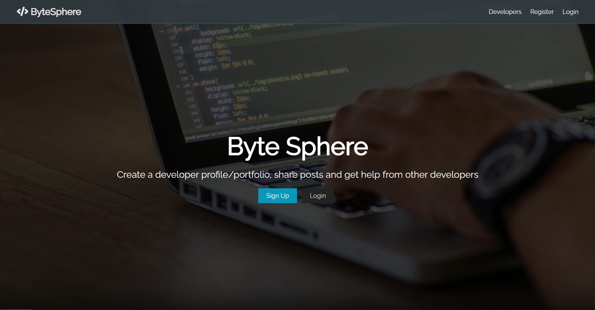
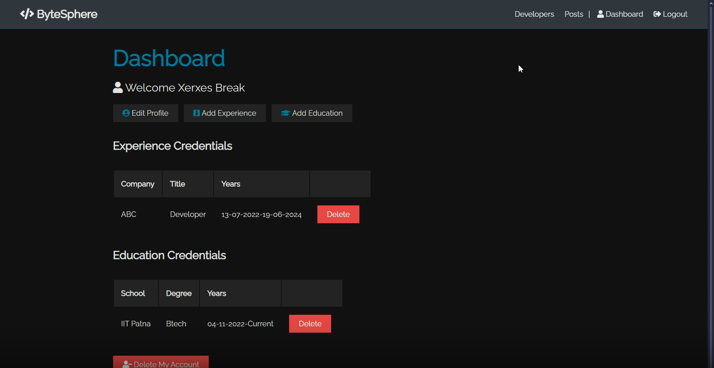
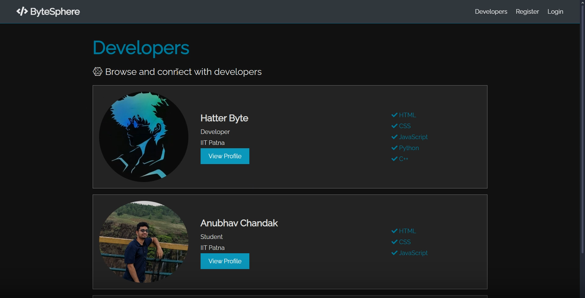
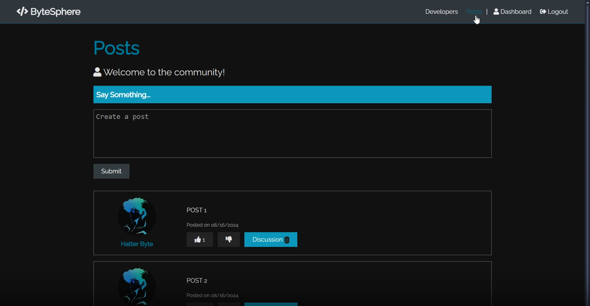

# ByteSphere 

A fullstack developer community platform built using the **MERN stack** (MongoDB, Express.js, React, Node.js).

##  Live Demo

[🔗 Click here to visit the deployed site](https://byte-sphere.vercel.app/)

---

##  Features

###  Authentication
- User **Login & Signup** with JWT token-based auth
- Passwords are securely hashed
- Protected routes using middleware

###  Developer Profile Management
- Create and edit your profile
- Add educational qualifications
- Add work experiences
- Upload social links (GitHub, LinkedIn, etc.)

###  Developer Directory
- View all registered developer profiles
- View full developer details by clicking on a profile

###  Posts & Community
- Create, like, comment on posts
- All users can see community posts
- Authenticated users can contribute or interact

---

##  Screenshots

###  Landing Page


###  Dashboard


###  Developer Profiles


###  Posts Page


--- 
##  Tech Stack

| Tech | Purpose |
|------|---------|
| **MongoDB** | Database for storing users, profiles, posts |
| **Express.js** | Node.js web framework for API routes |
| **React.js** | Frontend framework |
| **Redux Toolkit** | State management for auth, profiles, posts |
| **JWT** | Secure authentication |
| **Render** | Deployment (both frontend and backend) |

---

## Folder Structure

ByteSphere/
├── client/ # Frontend (React app)
├── config/ # Config files (use .gitignore for secrets)
├── middleware/ # Express middleware (auth, error handlers)
├── models/ # Mongoose models
├── routes/ # Express API routes (auth, posts, users, profile)
├── server.js # Entry point for Express server
├── .gitignore
├── package.json

---

##  Running Locally

### 1. Clone the repo

```bash
git clone https://github.com/yourusername/ByteSphere.git
cd ByteSphere

```
### 2. Set up the backend
```
npm install
npm run server
```
### 3. Set up .env
```
{ 
  MONGO_URI = <your-mongo-uri>>
  JWT_SECRET = <your-secret>
  GITHUB_CLIENT_ID = <xxxxxx>
  GITHUB_SECRET= <xxxxxxxx>
}
```
### 4. Set up the frontend
```
cd client
npm install
npm start
```
## Deployment
* Frontend deployed on Render Static Site

* Backend deployed on Render Web Service

#### Make sure to:

* Use cors in backend

* Allow environment variables in frontend for API base URLs

